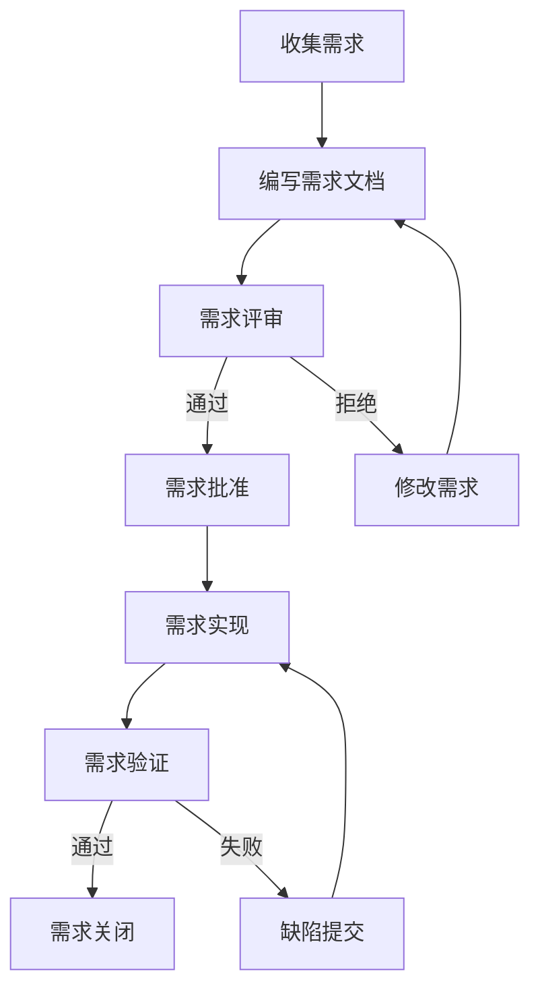
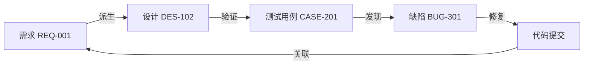

# 企业级开源需求/设计/缺陷管理工具 - 业务需求文档 (BRD)

---

## 文档信息
| 属性 | 值 |
|------|------|
| 文档版本 | v1.0 |
| 文档类型 | BRD (Business Requirements Document) |
| 创建日期 | 2026-05-11 |

---

## 一、业务背景

### 1.1 市场背景
随着企业数字化转型加速，项目管理工具的需求日益增长。目前市场上的解决方案存在以下痛点：
- **商业工具**（如Jira）成本高昂，中小企业难以承受
- **开源工具**（如OpenProject）功能有限，缺乏双向追溯能力
- **行业合规要求**（ASPICE 4.0、ISO26262、ISO21434等）需要专业的追溯能力和过程管理

### 1.2 业务目标
开发一款**企业级、开源免费、高扩展性**的项目管理工具，核心特色是**需求-设计-验证的双向可追溯性**。

### 1.3 目标用户
| 用户角色 | 需求描述 |
|----------|----------|
| 产品经理 | 需求管理、版本控制、评审流程 |
| 开发团队 | 任务管理、敏捷迭代、代码关联 |
| 测试团队 | 测试用例、缺陷管理、覆盖率统计 |
| 管理人员 | 项目进度、报表分析、合规审计 |
| 质量保证 | 追溯验证、合规检查、文档管理 |

---

## 二、业务需求概述

### 2.1 核心业务价值
| 价值点 | 描述 |
|--------|------|
| 全链路追溯 | 需求→设计→验证→缺陷的双向追溯 |
| 敏捷协作 | Jira级任务管理、看板、迭代规划 |
| ASPICE 4.0合规 | 满足ASPICE 4.0标准，支持过程评估和能力等级提升 |
| ISO合规支持 | 满足ISO26262、ISO21434、ISO21448等行业标准 |
| 文档管理 | Word/Excel文档条目化、版本控制 |
| 代码集成 | 支持Gerrit、Git、SVN代码仓库 |

### 2.2 业务流程

#### 需求管理流程

#### 追溯流程

---

## 三、业务指标

### 3.1 成功标准
| 指标 | 目标 |
|------|------|
| 需求覆盖率 | ≥95%（需求有对应的设计和验证） |
| 缺陷修复率 | ≥90%（迭代内修复） |
| 用户满意度 | ≥4.5/5 |
| 部署成功率 | ≥99% |

### 3.2 运营指标
| 指标 | 描述 |
|------|------|
| 活跃用户数 | 月度活跃用户增长 |
| 项目数 | 平台托管项目数量 |
| 文档数 | 平台存储文档数量 |
| API调用量 | 每日API调用次数 |

---

## 四、项目范围

### 4.1 包含范围
- 需求管理模块
- 设计管理模块
- 测试管理模块
- 缺陷管理模块
- 敏捷管理模块
- 双向追溯模块
- 文档条目化模块
- 代码仓库集成模块
- ISO合规性模块
- 部署与运维模块

### 4.2 排除范围（后续迭代）
- 移动端APP
- 第三方即时通讯集成
- 高级数据分析功能

---

**文档版本**: v1.0  
**文档类型**: BRD  
**创建日期**: 2026-05-11  
**作者**: ALM_Opensource Team