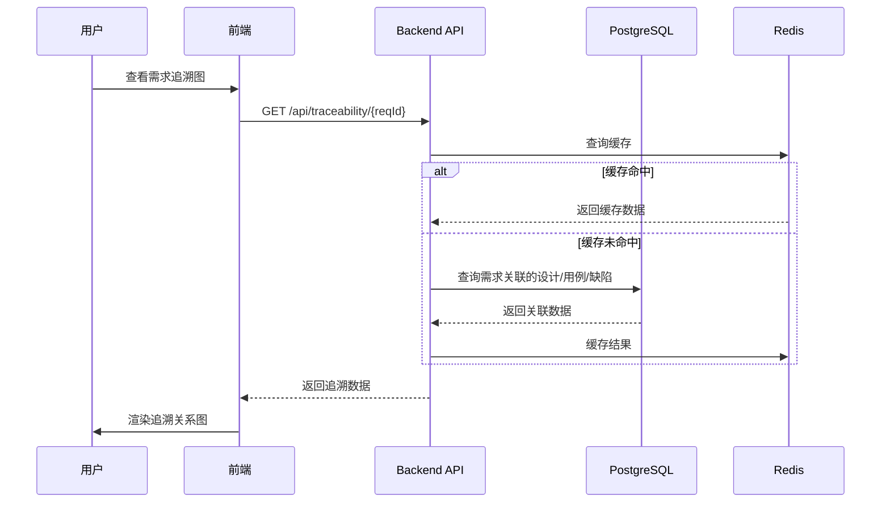

# 企业级开源需求/设计/缺陷管理工具 - 技术设计文档 (TD)

---

## 文档信息
| 属性 | 值 |
|------|------|
| 文档版本 | v0.2 |
| 文档类型 | TD (Technical Design Document) |
| 创建日期 | 2026-05-11 |
| 关联PRD | PRD_v1.5.md |

---

## 一、技术选型

### 1.1 前端技术栈
| 分类 | 技术 | 版本 |
|------|------|------|
| 框架 | Vue3 + TypeScript | 3.x |
| UI库 | Element Plus | 2.x |
| 状态管理 | Pinia | 2.x |
| 可视化 | ECharts | 5.x |
| 关系图 | AntV G6 | 4.x |
| 富文本 | TipTap | 2.x |

### 1.2 后端技术栈
| 分类 | 技术 | 版本 |
|------|------|------|
| 语言 | Java | 21 |
| 框架 | Spring Boot | 3.x |
| 安全 | Spring Security + JWT | - |
| ORM | MyBatis-Plus | 3.5.x |
| 消息 | WebSocket | - |

### 1.3 数据库技术栈
| 分类 | 技术 | 版本 |
|------|------|------|
| 主库 | PostgreSQL | 16.x |
| 缓存 | Redis | 7.x |
| 搜索 | Elasticsearch | 8.x（可选） |

### 1.4 部署技术栈
| 分类 | 技术 |
|------|------|
| 容器 | Docker + Docker Compose |
| CI/CD | Jenkins / GitHub Actions |
| 监控 | Prometheus + Grafana |

---

## 二、架构设计

### 2.1 模块划分
```
backend/
├── controller/     # REST API控制层
├── service/        # 业务逻辑层
├── repository/     # 数据访问层
├── entity/         # 数据库实体
├── dto/            # 数据传输对象
├── config/         # 配置类
├── security/       # 安全模块
└── traceability/   # 追溯核心模块

frontend/
├── components/     # 通用组件
├── views/          # 页面视图
│   ├── project/    # 项目管理
│   ├── requirement/# 需求管理
│   ├── design/     # 设计管理
│   ├── test/       # 测试管理
│   ├── task/       # 任务管理
│   ├── traceability/# 追溯中心
│   └── report/     # 报表中心
├── stores/         # Pinia状态管理
└── api/            # API封装
```

### 2.2 核心流程图

#### 追溯查询流程


---

## 三、数据模型设计

### 3.1 核心业务表

#### requirements（需求表）
| 字段 | 类型 | 说明 |
|------|------|------|
| req_id | VARCHAR(32) | 需求ID（主键） |
| title | VARCHAR(255) | 需求标题 |
| content | TEXT | 需求描述 |
| type | VARCHAR(32) | 需求类型 |
| priority | VARCHAR(16) | 优先级 |
| status | VARCHAR(32) | 状态 |
| project_id | VARCHAR(32) | 所属项目ID |
| version | VARCHAR(16) | 版本号 |
| created_at | TIMESTAMP | 创建时间 |

#### designs（设计表）
| 字段 | 类型 | 说明 |
|------|------|------|
| design_id | VARCHAR(32) | 设计ID（主键） |
| title | VARCHAR(255) | 设计标题 |
| content | TEXT | 设计内容 |
| type | VARCHAR(32) | 设计类型 |
| project_id | VARCHAR(32) | 所属项目ID |
| version | VARCHAR(16) | 版本号 |
| created_at | TIMESTAMP | 创建时间 |

#### test_cases（测试用例表）
| 字段 | 类型 | 说明 |
|------|------|------|
| case_id | VARCHAR(32) | 用例ID（主键） |
| title | VARCHAR(255) | 用例标题 |
| steps | TEXT | 测试步骤 |
| expected | TEXT | 预期结果 |
| project_id | VARCHAR(32) | 所属项目ID |
| created_at | TIMESTAMP | 创建时间 |

#### tasks（任务/缺陷表）
| 字段 | 类型 | 说明 |
|------|------|------|
| task_id | VARCHAR(32) | 任务ID（主键） |
| type | VARCHAR(32) | 类型（TASK/BUG） |
| title | VARCHAR(255) | 标题 |
| status | VARCHAR(32) | 状态 |
| priority | VARCHAR(16) | 优先级 |
| assignee_id | VARCHAR(32) | 经办人ID |
| sprint_id | VARCHAR(32) | 所属迭代ID |
| project_id | VARCHAR(32) | 所属项目ID |
| created_at | TIMESTAMP | 创建时间 |

### 3.2 追溯关系表（核心）

#### traceability_req_design
| 字段 | 类型 | 说明 |
|------|------|------|
| id | BIGINT | 主键 |
| req_id | VARCHAR(32) | 需求ID |
| design_id | VARCHAR(32) | 设计ID |
| relation_type | VARCHAR(32) | 关系类型 |

#### traceability_design_test
| 字段 | 类型 | 说明 |
|------|------|------|
| id | BIGINT | 主键 |
| design_id | VARCHAR(32) | 设计ID |
| case_id | VARCHAR(32) | 测试用例ID |
| relation_type | VARCHAR(32) | 关系类型 |

#### traceability_item_task
| 字段 | 类型 | 说明 |
|------|------|------|
| id | BIGINT | 主键 |
| item_type | VARCHAR(32) | 对象类型（REQ/DESIGN/TEST） |
| item_id | VARCHAR(32) | 对象ID |
| task_id | VARCHAR(32) | 任务/缺陷ID |

### 3.3 ASPICE 4.0相关表

#### aspice_process_domain（ASPICE过程域表）
| 字段 | 类型 | 说明 |
|------|------|------|
| domain_id | VARCHAR(32) | 过程域ID（如SWE.1、SUP.8） |
| name | VARCHAR(100) | 过程域名称 |
| description | TEXT | 过程域描述 |
| category | VARCHAR(32) | 类别（SWE/SUP/SAM/ENG等） |
| capability_levels | VARCHAR(255) | 能力等级（CL1-CL5） |

#### aspice_work_product（ASPICE工作产品表）
| 字段 | 类型 | 说明 |
|------|------|------|
| product_id | VARCHAR(32) | 工作产品ID |
| domain_id | VARCHAR(32) | 所属过程域ID |
| name | VARCHAR(100) | 工作产品名称 |
| description | TEXT | 工作产品描述 |
| required | BOOLEAN | 是否必需 |

#### aspice_assessment（ASPICE评估表）
| 字段 | 类型 | 说明 |
|------|------|------|
| assessment_id | VARCHAR(32) | 评估ID |
| project_id | VARCHAR(32) | 项目ID |
| domain_id | VARCHAR(32) | 过程域ID |
| capability_level | VARCHAR(16) | 评估能力等级 |
| status | VARCHAR(32) | 评估状态（PLANNED/IN_PROGRESS/COMPLETED） |
| findings | TEXT | 评估发现 |
| recommendations | TEXT | 改进建议 |
| assessed_at | TIMESTAMP | 评估时间 |

#### aspice_metric（ASPICE度量数据表）
| 字段 | 类型 | 说明 |
|------|------|------|
| metric_id | VARCHAR(32) | 度量ID |
| project_id | VARCHAR(32) | 项目ID |
| domain_id | VARCHAR(32) | 过程域ID |
| metric_name | VARCHAR(100) | 度量名称 |
| metric_value | VARCHAR(255) | 度量值 |
| collected_at | TIMESTAMP | 收集时间 |

### 3.4 审批流相关表

#### approval_template（审批流程模板表）
| 字段 | 类型 | 说明 |
|------|------|------|
| template_id | VARCHAR(32) | 模板ID（主键） |
| name | VARCHAR(100) | 模板名称 |
| description | TEXT | 模板描述 |
| workflow_json | TEXT | 流程定义JSON |
| is_active | BOOLEAN | 是否启用 |
| created_by | VARCHAR(32) | 创建人ID |
| created_at | TIMESTAMP | 创建时间 |

#### approval_flow（审批流程实例表）
| 字段 | 类型 | 说明 |
|------|------|------|
| flow_id | VARCHAR(32) | 流程实例ID（主键） |
| template_id | VARCHAR(32) | 关联模板ID |
| document_id | VARCHAR(32) | 关联文档ID |
| document_type | VARCHAR(32) | 文档类型 |
| status | VARCHAR(32) | 流程状态（PENDING/IN_PROGRESS/APPROVED/REJECTED/WITHDRAWN） |
| applicant_id | VARCHAR(32) | 申请人ID |
| title | VARCHAR(255) | 申请标题 |
| created_at | TIMESTAMP | 创建时间 |
| updated_at | TIMESTAMP | 更新时间 |

#### approval_node（审批节点表）
| 字段 | 类型 | 说明 |
|------|------|------|
| node_id | VARCHAR(32) | 节点ID（主键） |
| flow_id | VARCHAR(32) | 关联流程ID |
| node_type | VARCHAR(32) | 节点类型（SERIAL/PARALLEL） |
| node_order | INT | 节点顺序 |
| status | VARCHAR(32) | 节点状态（PENDING/APPROVED/REJECTED） |
| created_at | TIMESTAMP | 创建时间 |

#### approval_task（审批任务表）
| 字段 | 类型 | 说明 |
|------|------|------|
| task_id | VARCHAR(32) | 任务ID（主键） |
| node_id | VARCHAR(32) | 关联节点ID |
| assignee_id | VARCHAR(32) | 审批人ID |
| status | VARCHAR(32) | 任务状态（PENDING/APPROVED/REJECTED/TRANSFERRED） |
| comment | TEXT | 审批意见 |
| added_by | VARCHAR(32) | 加签人ID（用于加签场景） |
| added_type | VARCHAR(16) | 加签类型（BEFORE/AFTER） |
| transferred_from | VARCHAR(32) | 转签来源人ID |
| created_at | TIMESTAMP | 创建时间 |
| completed_at | TIMESTAMP | 完成时间 |

#### approval_delegation（审批委托表）
| 字段 | 类型 | 说明 |
|------|------|------|
| delegation_id | VARCHAR(32) | 委托ID（主键） |
| delegator_id | VARCHAR(32) | 委托人ID |
| delegatee_id | VARCHAR(32) | 被委托人ID |
| start_time | TIMESTAMP | 委托开始时间 |
| end_time | TIMESTAMP | 委托结束时间 |
| is_active | BOOLEAN | 是否有效 |
| created_at | TIMESTAMP | 创建时间 |

### 3.5 组织架构同步相关表

#### organization（组织架构表）
| 字段 | 类型 | 说明 |
|------|------|------|
| org_id | VARCHAR(32) | 组织ID（主键） |
| name | VARCHAR(100) | 组织名称 |
| parent_id | VARCHAR(32) | 上级组织ID |
| type | VARCHAR(32) | 组织类型（COMPANY/DEPARTMENT/TEAM） |
| external_id | VARCHAR(100) | 外部系统ID |
| sync_source | VARCHAR(50) | 同步来源 |
| created_at | TIMESTAMP | 创建时间 |
| updated_at | TIMESTAMP | 更新时间 |

#### sync_config（同步配置表）
| 字段 | 类型 | 说明 |
|------|------|------|
| config_id | VARCHAR(32) | 配置ID（主键） |
| name | VARCHAR(100) | 配置名称 |
| type | VARCHAR(32) | 同步类型（LDAP/SCIM/API） |
| config_json | TEXT | 配置参数JSON |
| sync_frequency | INT | 同步频率（分钟） |
| sync_mode | VARCHAR(16) | 同步模式（FULL/INCREMENTAL） |
| conflict_strategy | VARCHAR(16) | 冲突策略（OVERWRITE/SKIP/MERGE） |
| is_active | BOOLEAN | 是否启用 |
| created_at | TIMESTAMP | 创建时间 |

#### sync_task（同步任务表）
| 字段 | 类型 | 说明 |
|------|------|------|
| task_id | VARCHAR(32) | 任务ID（主键） |
| config_id | VARCHAR(32) | 关联配置ID |
| status | VARCHAR(32) | 任务状态（PENDING/RUNNING/SUCCESS/FAILED） |
| sync_type | VARCHAR(32) | 同步类型（ORG/ROLE/USER） |
| start_time | TIMESTAMP | 开始时间 |
| end_time | TIMESTAMP | 结束时间 |
| sync_count | INT | 同步数量 |
| error_message | TEXT | 错误信息 |
| created_at | TIMESTAMP | 创建时间 |

#### sync_log（同步日志表）
| 字段 | 类型 | 说明 |
|------|------|------|
| log_id | VARCHAR(32) | 日志ID（主键） |
| task_id | VARCHAR(32) | 关联任务ID |
| operation_type | VARCHAR(32) | 操作类型（CREATE/UPDATE/DELETE/SKIP） |
| target_type | VARCHAR(32) | 目标类型（ORG/ROLE/USER） |
| target_id | VARCHAR(32) | 目标ID |
| target_name | VARCHAR(255) | 目标名称 |
| external_id | VARCHAR(100) | 外部系统ID |
| message | TEXT | 日志消息 |
| created_at | TIMESTAMP | 创建时间 |

### 3.6 AI模型配置表

#### ai_model（AI模型配置表）
| 字段 | 类型 | 说明 |
|------|------|------|
| model_id | VARCHAR(32) | 模型ID（主键） |
| name | VARCHAR(100) | 模型名称 |
| provider | VARCHAR(50) | 模型提供商（DEEPSEEK/XUNFEI/BAIDU/OPENAI/ANTHROPIC） |
| api_base_url | VARCHAR(255) | API基础URL |
| api_key | VARCHAR(255) | API密钥（加密存储） |
| model_name | VARCHAR(100) | 模型名称（如deepseek-chat） |
| max_tokens | INT | 最大token数 |
| temperature | DECIMAL(3,2) | 温度参数 |
| is_active | BOOLEAN | 是否启用 |
| created_at | TIMESTAMP | 创建时间 |

#### ai_generation_log（AI生成日志表）
| 字段 | 类型 | 说明 |
|------|------|------|
| log_id | VARCHAR(32) | 日志ID（主键） |
| model_id | VARCHAR(32) | 使用的模型ID |
| generation_type | VARCHAR(32) | 生成类型（REQUIREMENT/DESIGN/TEST_CASE） |
| input_text | TEXT | 输入文本 |
| output_text | TEXT | 输出文本 |
| token_usage | INT | token使用量 |
| duration_ms | INT | 耗时（毫秒） |
| success | BOOLEAN | 是否成功 |
| error_message | TEXT | 错误信息 |
| created_at | TIMESTAMP | 创建时间 |

### 3.7 国际化相关表

#### language（语言表）
| 字段 | 类型 | 说明 |
|------|------|------|
| lang_code | VARCHAR(10) | 语言代码（zh-CN/en-US） |
| name | VARCHAR(50) | 语言名称 |
| native_name | VARCHAR(50) | 本地语言名称 |
| is_active | BOOLEAN | 是否启用 |

#### user_language（用户语言偏好表）
| 字段 | 类型 | 说明 |
|------|------|------|
| user_id | VARCHAR(32) | 用户ID（主键） |
| lang_code | VARCHAR(10) | 语言代码 |
| created_at | TIMESTAMP | 创建时间 |

### 3.8 开源网盘集成相关表

#### storage_config（存储配置表）
| 字段 | 类型 | 说明 |
|------|------|------|
| config_id | VARCHAR(32) | 配置ID（主键） |
| name | VARCHAR(100) | 配置名称 |
| type | VARCHAR(32) | 存储类型（NEXTCLOUD/SEAFILE/OWNCLOUD/LOCAL） |
| endpoint_url | VARCHAR(255) | 服务端点URL |
| username | VARCHAR(100) | 用户名 |
| password | VARCHAR(255) | 密码（加密存储） |
| api_key | VARCHAR(255) | API密钥 |
| base_path | VARCHAR(255) | 基础存储路径 |
| is_default | BOOLEAN | 是否默认配置 |
| is_active | BOOLEAN | 是否启用 |
| created_at | TIMESTAMP | 创建时间 |

#### file_storage（文件存储表）
| 字段 | 类型 | 说明 |
|------|------|------|
| file_id | VARCHAR(32) | 文件ID（主键） |
| config_id | VARCHAR(32) | 关联存储配置ID |
| original_name | VARCHAR(255) | 原始文件名 |
| storage_path | VARCHAR(500) | 存储路径 |
| file_size | BIGINT | 文件大小（字节） |
| file_type | VARCHAR(100) | 文件类型（MIME类型） |
| hash_md5 | VARCHAR(32) | MD5哈希值 |
| status | VARCHAR(32) | 文件状态（UPLOADED/SYNCED/DELETED/ARCHIVED/OBSOLETE） |
| iso_file_number | VARCHAR(100) | ISO9001文件编号 |
| controlled | BOOLEAN | 是否受控文件 |
| distribution_status | VARCHAR(32) | 分发状态（PENDING/DISTRIBUTED/REVOKED） |
| obsoleted_by | VARCHAR(32) | 替代文件ID |
| archived_at | TIMESTAMP | 归档时间 |
| archived_by | VARCHAR(32) | 归档人ID |
| created_by | VARCHAR(32) | 上传人ID |
| created_at | TIMESTAMP | 创建时间 |
| updated_at | TIMESTAMP | 更新时间 |

#### file_permission（文件权限表）
| 字段 | 类型 | 说明 |
|------|------|------|
| permission_id | VARCHAR(32) | 权限ID（主键） |
| file_id | VARCHAR(32) | 关联文件ID |
| user_id | VARCHAR(32) | 用户ID |
| role_id | VARCHAR(32) | 角色ID |
| permissions | VARCHAR(100) | 权限列表（READ/WRITE/DELETE/DOWNLOAD） |
| created_at | TIMESTAMP | 创建时间 |

#### file_version（文件版本表）
| 字段 | 类型 | 说明 |
|------|------|------|
| version_id | VARCHAR(32) | 版本ID（主键） |
| file_id | VARCHAR(32) | 关联文件ID |
| version_number | VARCHAR(20) | 版本号（如1.0.0） |
| storage_path | VARCHAR(500) | 版本文件路径 |
| change_log | TEXT | 变更说明 |
| created_by | VARCHAR(32) | 创建人ID |
| created_at | TIMESTAMP | 创建时间 |

### 3.9 产品基线库管理相关表

#### baseline_repository（基线库表）
| 字段 | 类型 | 说明 |
|------|------|------|
| repo_id | VARCHAR(32) | 基线库ID（主键） |
| name | VARCHAR(100) | 基线库名称 |
| description | TEXT | 基线库描述 |
| product_id | VARCHAR(32) | 关联产品ID |
| scope_config | JSON | 基线范围配置 |
| freeze_rule | JSON | 冻结规则配置 |
| is_active | BOOLEAN | 是否启用 |
| created_by | VARCHAR(32) | 创建人ID |
| created_at | TIMESTAMP | 创建时间 |
| updated_at | TIMESTAMP | 更新时间 |

#### baseline_version（基线版本表）
| 字段 | 类型 | 说明 |
|------|------|------|
| version_id | VARCHAR(32) | 基线版本ID（主键） |
| repo_id | VARCHAR(32) | 关联基线库ID |
| version_number | VARCHAR(50) | 基线版本号（如V1.0.0） |
| status | VARCHAR(32) | 状态（DRAFT/FROZEN/RELEASED/DEPRECATED） |
| baseline_date | TIMESTAMP | 基线创建日期 |
| description | TEXT | 版本描述 |
| contents | JSON | 基线内容清单 |
| created_by | VARCHAR(32) | 创建人ID |
| created_at | TIMESTAMP | 创建时间 |

#### baseline_item（基线条目表）
| 字段 | 类型 | 说明 |
|------|------|------|
| item_id | VARCHAR(32) | 条目ID（主键） |
| version_id | VARCHAR(32) | 关联基线版本ID |
| item_type | VARCHAR(32) | 条目类型（REQUIREMENT/DESIGN/TESTCASE/DOCUMENT） |
| item_id_ref | VARCHAR(32) | 关联项目ID |
| item_version | VARCHAR(20) | 条目版本号 |
| added_by | VARCHAR(32) | 添加人ID |
| added_at | TIMESTAMP | 添加时间 |

#### change_request（变更请求表）
| 字段 | 类型 | 说明 |
|------|------|------|
| request_id | VARCHAR(32) | 变更请求ID（主键） |
| repo_id | VARCHAR(32) | 关联基线库ID |
| baseline_version_id | VARCHAR(32) | 关联基线版本ID |
| title | VARCHAR(255) | 变更标题 |
| description | TEXT | 变更描述 |
| change_type | VARCHAR(32) | 变更类型（ADD/MODIFY/DELETE） |
| affected_items | JSON | 受影响的条目列表 |
| impact_analysis | TEXT | 影响分析报告 |
| status | VARCHAR(32) | 状态（DRAFT/SUBMITTED/APPROVED/REJECTED/EXECUTED/CANCELLED） |
| created_by | VARCHAR(32) | 创建人ID |
| created_at | TIMESTAMP | 创建时间 |
| updated_at | TIMESTAMP | 更新时间 |

#### change_approval（变更审批表）
| 字段 | 类型 | 说明 |
|------|------|------|
| approval_id | VARCHAR(32) | 审批ID（主键） |
| request_id | VARCHAR(32) | 关联变更请求ID |
| approver_id | VARCHAR(32) | 审批人ID |
| status | VARCHAR(32) | 审批状态（PENDING/APPROVED/REJECTED） |
| comment | TEXT | 审批意见 |
| approved_at | TIMESTAMP | 审批时间 |

#### baseline_audit_log（基线审计日志表）
| 字段 | 类型 | 说明 |
|------|------|------|
| log_id | VARCHAR(32) | 日志ID（主键） |
| repo_id | VARCHAR(32) | 关联基线库ID |
| version_id | VARCHAR(32) | 关联基线版本ID |
| operation_type | VARCHAR(32) | 操作类型（CREATE/FREEZE/RELEASE/MODIFY/ROLLBACK/CHANGE） |
| operation_desc | TEXT | 操作描述 |
| operator_id | VARCHAR(32) | 操作人ID |
| operator_name | VARCHAR(100) | 操作人姓名 |
| created_at | TIMESTAMP | 操作时间 |

### 3.10 ISO9001文件管理合规相关表

#### file_distribution（文件分发记录表）
| 字段 | 类型 | 说明 |
|------|------|------|
| distribution_id | VARCHAR(32) | 分发记录ID（主键） |
| file_id | VARCHAR(32) | 关联文件ID |
| recipient_id | VARCHAR(32) | 接收人ID |
| recipient_name | VARCHAR(100) | 接收人姓名 |
| distribution_date | TIMESTAMP | 分发日期 |
| received | BOOLEAN | 是否已接收 |
| received_date | TIMESTAMP | 接收日期 |
| distribution_method | VARCHAR(32) | 分发方式（EMAIL/PRINT/ONLINE） |
| remarks | TEXT | 备注 |
| created_by | VARCHAR(32) | 创建人ID |
| created_at | TIMESTAMP | 创建时间 |

#### file_audit_trail（文件审计追踪表）
| 字段 | 类型 | 说明 |
|------|------|------|
| trail_id | VARCHAR(32) | 审计记录ID（主键） |
| file_id | VARCHAR(32) | 关联文件ID |
| operation_type | VARCHAR(32) | 操作类型（CREATE/MODIFY/DELETE/DISTRIBUTE/ARCHIVE/OBSOLETE） |
| operator_id | VARCHAR(32) | 操作人ID |
| operator_name | VARCHAR(100) | 操作人姓名 |
| operation_date | TIMESTAMP | 操作日期 |
| details | JSON | 操作详情 |
| ip_address | VARCHAR(50) | 操作IP地址 |

### 3.11 任务模板管理相关表

#### task_template（任务模板表）
| 字段 | 类型 | 说明 |
|------|------|------|
| template_id | VARCHAR(32) | 模板ID（主键） |
| name | VARCHAR(100) | 模板名称 |
| description | TEXT | 模板描述 |
| category | VARCHAR(50) | 模板分类 |
| project_type | VARCHAR(50) | 适用项目类型 |
| phase | VARCHAR(50) | 适用项目阶段 |
| status | VARCHAR(32) | 状态（ACTIVE/INACTIVE/DRAFT） |
| parameters | JSON | 参数配置 |
| created_by | VARCHAR(32) | 创建人ID |
| created_at | TIMESTAMP | 创建时间 |
| updated_at | TIMESTAMP | 更新时间 |

#### task_template_field（任务模板字段表）
| 字段 | 类型 | 说明 |
|------|------|------|
| field_id | VARCHAR(32) | 字段ID（主键） |
| template_id | VARCHAR(32) | 关联模板ID |
| field_name | VARCHAR(100) | 字段名称 |
| field_type | VARCHAR(32) | 字段类型（TEXT/NUMBER/DATE/SELECT/MULTISELECT/CHECKBOX） |
| required | BOOLEAN | 是否必填 |
| default_value | TEXT | 默认值 |
| options | JSON | 选项列表（SELECT类型用） |
| sort_order | INT | 排序顺序 |
| created_at | TIMESTAMP | 创建时间 |

#### task_template_version（任务模板版本表）
| 字段 | 类型 | 说明 |
|------|------|------|
| version_id | VARCHAR(32) | 版本ID（主键） |
| template_id | VARCHAR(32) | 关联模板ID |
| version_number | VARCHAR(20) | 版本号 |
| change_log | TEXT | 变更日志 |
| template_snapshot | JSON | 模板快照 |
| created_by | VARCHAR(32) | 创建人ID |
| created_at | TIMESTAMP | 创建时间 |

### 3.12 知识库管理相关表（类似Confluence）

#### knowledge_space（知识空间表）
| 字段 | 类型 | 说明 |
|------|------|------|
| space_id | VARCHAR(32) | 空间ID（主键） |
| name | VARCHAR(100) | 空间名称 |
| key | VARCHAR(50) | 空间标识（唯一） |
| description | TEXT | 空间描述 |
| icon | VARCHAR(255) | 空间图标 |
| theme | VARCHAR(50) | 空间主题 |
| status | VARCHAR(32) | 状态（ACTIVE/INACTIVE/ARCHIVED） |
| created_by | VARCHAR(32) | 创建人ID |
| created_at | TIMESTAMP | 创建时间 |
| updated_at | TIMESTAMP | 更新时间 |

#### knowledge_page（知识页面表）
| 字段 | 类型 | 说明 |
|------|------|------|
| page_id | VARCHAR(32) | 页面ID（主键） |
| space_id | VARCHAR(32) | 关联空间ID |
| parent_id | VARCHAR(32) | 父页面ID |
| title | VARCHAR(255) | 页面标题 |
| content | LONGTEXT | 页面内容 |
| content_format | VARCHAR(20) | 内容格式（MARKDOWN/RICHTEXT/HTML） |
| status | VARCHAR(32) | 状态（DRAFT/PUBLISHED/ARCHIVED） |
| view_count | INT | 浏览次数 |
| created_by | VARCHAR(32) | 创建人ID |
| created_at | TIMESTAMP | 创建时间 |
| updated_by | VARCHAR(32) | 更新人ID |
| updated_at | TIMESTAMP | 更新时间 |

#### knowledge_page_version（页面版本表）
| 字段 | 类型 | 说明 |
|------|------|------|
| version_id | VARCHAR(32) | 版本ID（主键） |
| page_id | VARCHAR(32) | 关联页面ID |
| version_number | VARCHAR(20) | 版本号 |
| content | LONGTEXT | 版本内容 |
| change_log | TEXT | 变更说明 |
| created_by | VARCHAR(32) | 创建人ID |
| created_at | TIMESTAMP | 创建时间 |

#### knowledge_page_tag（页面标签表）
| 字段 | 类型 | 说明 |
|------|------|------|
| tag_id | VARCHAR(32) | 标签ID（主键） |
| page_id | VARCHAR(32) | 关联页面ID |
| tag_name | VARCHAR(50) | 标签名称 |
| created_at | TIMESTAMP | 创建时间 |

#### knowledge_page_attachment（页面附件表）
| 字段 | 类型 | 说明 |
|------|------|------|
| attachment_id | VARCHAR(32) | 附件ID（主键） |
| page_id | VARCHAR(32) | 关联页面ID |
| file_name | VARCHAR(255) | 文件名 |
| file_path | VARCHAR(500) | 文件路径 |
| file_size | BIGINT | 文件大小 |
| file_type | VARCHAR(100) | 文件类型 |
| created_by | VARCHAR(32) | 创建人ID |
| created_at | TIMESTAMP | 创建时间 |

#### knowledge_page_comment（页面评论表）
| 字段 | 类型 | 说明 |
|------|------|------|
| comment_id | VARCHAR(32) | 评论ID（主键） |
| page_id | VARCHAR(32) | 关联页面ID |
| parent_id | VARCHAR(32) | 父评论ID（支持回复） |
| content | TEXT | 评论内容 |
| created_by | VARCHAR(32) | 创建人ID |
| created_at | TIMESTAMP | 创建时间 |

#### knowledge_page_favorite（页面收藏表）
| 字段 | 类型 | 说明 |
|------|------|------|
| favorite_id | VARCHAR(32) | 收藏ID（主键） |
| page_id | VARCHAR(32) | 关联页面ID |
| user_id | VARCHAR(32) | 用户ID |
| created_at | TIMESTAMP | 创建时间 |

#### knowledge_page_permission（页面权限表）
| 字段 | 类型 | 说明 |
|------|------|------|
| permission_id | VARCHAR(32) | 权限ID（主键） |
| page_id | VARCHAR(32) | 关联页面ID |
| user_id | VARCHAR(32) | 用户ID |
| role_id | VARCHAR(32) | 角色ID |
| permissions | VARCHAR(100) | 权限列表（READ/WRITE/DELETE/COMMENT） |
| created_at | TIMESTAMP | 创建时间 |

### 3.13 数据报表插件相关表（类似Jira）

#### report_plugin（报表插件表）
| 字段 | 类型 | 说明 |
|------|------|------|
| plugin_id | VARCHAR(32) | 插件ID（主键） |
| name | VARCHAR(100) | 插件名称 |
| description | TEXT | 插件描述 |
| type | VARCHAR(50) | 插件类型（CHART/TABLE/CUSTOM） |
| icon | VARCHAR(255) | 插件图标 |
| config | JSON | 插件配置 |
| status | VARCHAR(32) | 状态（ENABLED/DISABLED） |
| created_by | VARCHAR(32) | 创建人ID |
| created_at | TIMESTAMP | 创建时间 |
| updated_at | TIMESTAMP | 更新时间 |

#### report_template（报表模板表）
| 字段 | 类型 | 说明 |
|------|------|------|
| template_id | VARCHAR(32) | 模板ID（主键） |
| name | VARCHAR(100) | 模板名称 |
| description | TEXT | 模板描述 |
| plugin_id | VARCHAR(32) | 关联插件ID |
| config | JSON | 模板配置（数据源、字段映射、样式等） |
| chart_type | VARCHAR(50) | 图表类型（LINE/BAR/PIE/TABLE） |
| category | VARCHAR(50) | 模板分类（进度/质量/资源等） |
| status | VARCHAR(32) | 状态（ACTIVE/INACTIVE） |
| created_by | VARCHAR(32) | 创建人ID |
| created_at | TIMESTAMP | 创建时间 |

#### report_instance（报表实例表）
| 字段 | 类型 | 说明 |
|------|------|------|
| instance_id | VARCHAR(32) | 实例ID（主键） |
| name | VARCHAR(100) | 报表名称 |
| template_id | VARCHAR(32) | 关联模板ID |
| project_id | VARCHAR(32) | 关联项目ID |
| config | JSON | 报表配置（筛选条件、参数等） |
| last_run_at | TIMESTAMP | 最后运行时间 |
| last_run_status | VARCHAR(32) | 最后运行状态 |
| schedule_config | JSON | 调度配置 |
| created_by | VARCHAR(32) | 创建人ID |
| created_at | TIMESTAMP | 创建时间 |
| updated_at | TIMESTAMP | 更新时间 |

#### report_schedule（报表调度表）
| 字段 | 类型 | 说明 |
|------|------|------|
| schedule_id | VARCHAR(32) | 调度ID（主键） |
| instance_id | VARCHAR(32) | 关联报表实例ID |
| cron_expression | VARCHAR(100) | Cron表达式 |
| last_executed_at | TIMESTAMP | 最后执行时间 |
| next_execution_at | TIMESTAMP | 下次执行时间 |
| status | VARCHAR(32) | 状态（ACTIVE/PAUSED） |
| recipients | JSON | 接收人列表 |
| created_at | TIMESTAMP | 创建时间 |

### 3.14 个性化看板相关表

#### kanban_board（看板表）
| 字段 | 类型 | 说明 |
|------|------|------|
| board_id | VARCHAR(32) | 看板ID（主键） |
| name | VARCHAR(100) | 看板名称 |
| project_id | VARCHAR(32) | 关联项目ID |
| description | TEXT | 看板描述 |
| config | JSON | 看板配置（列定义、筛选条件等） |
| is_default | BOOLEAN | 是否默认看板 |
| created_by | VARCHAR(32) | 创建人ID |
| created_at | TIMESTAMP | 创建时间 |
| updated_at | TIMESTAMP | 更新时间 |

#### kanban_column（看板列表）
| 字段 | 类型 | 说明 |
|------|------|------|
| column_id | VARCHAR(32) | 列ID（主键） |
| board_id | VARCHAR(32) | 关联看板ID |
| name | VARCHAR(100) | 列名称 |
| field_key | VARCHAR(50) | 关联字段键（如status/priority） |
| field_value | VARCHAR(100) | 字段值（如TODO/IN_PROGRESS） |
| position | INT | 列位置顺序 |
| color | VARCHAR(20) | 列颜色 |
| config | JSON | 列配置 |
| created_at | TIMESTAMP | 创建时间 |

#### kanban_card_field（卡片字段配置表）
| 字段 | 类型 | 说明 |
|------|------|------|
| field_id | VARCHAR(32) | 字段配置ID（主键） |
| board_id | VARCHAR(32) | 关联看板ID |
| field_key | VARCHAR(50) | 字段键 |
| field_label | VARCHAR(100) | 字段显示标签 |
| display_position | INT | 显示位置 |
| visible | BOOLEAN | 是否可见 |
| created_at | TIMESTAMP | 创建时间 |

#### kanban_view（看板视图表）
| 字段 | 类型 | 说明 |
|------|------|------|
| view_id | VARCHAR(32) | 视图ID（主键） |
| board_id | VARCHAR(32) | 关联看板ID |
| name | VARCHAR(100) | 视图名称 |
| filter_config | JSON | 筛选配置 |
| sort_config | JSON | 排序配置 |
| is_default | BOOLEAN | 是否默认视图 |
| shared | BOOLEAN | 是否共享 |
| created_by | VARCHAR(32) | 创建人ID |
| created_at | TIMESTAMP | 创建时间 |

### 3.15 硬件电子工程师管理相关表

#### hardware_project（硬件项目表）
| 字段 | 类型 | 说明 |
|------|------|------|
| project_id | VARCHAR(32) | 项目ID（主键） |
| name | VARCHAR(100) | 项目名称 |
| description | TEXT | 项目描述 |
| status | VARCHAR(32) | 状态（PLANNING/IN_PROGRESS/COMPLETED） |
| created_by | VARCHAR(32) | 创建人ID |
| created_at | TIMESTAMP | 创建时间 |

#### hardware_schematic（原理图表）
| 字段 | 类型 | 说明 |
|------|------|------|
| schematic_id | VARCHAR(32) | 原理图ID（主键） |
| project_id | VARCHAR(32) | 关联项目ID |
| name | VARCHAR(255) | 文件名称 |
| file_path | VARCHAR(500) | 文件路径 |
| file_type | VARCHAR(50) | 文件类型（SCH/BRD等） |
| version | VARCHAR(20) | 版本号 |
| status | VARCHAR(32) | 状态（DRAFT/REVIEW/APPROVED） |
| thumbnail | VARCHAR(500) | 缩略图路径 |
| created_by | VARCHAR(32) | 创建人ID |
| created_at | TIMESTAMP | 创建时间 |

#### hardware_pcb（PCB设计表）
| 字段 | 类型 | 说明 |
|------|------|------|
| pcb_id | VARCHAR(32) | PCB ID（主键） |
| project_id | VARCHAR(32) | 关联项目ID |
| name | VARCHAR(255) | 文件名称 |
| file_path | VARCHAR(500) | 文件路径 |
| layers | INT | 层数 |
| size | VARCHAR(100) | 尺寸 |
| version | VARCHAR(20) | 版本号 |
| status | VARCHAR(32) | 状态 |
| thumbnail | VARCHAR(500) | 缩略图路径 |
| created_by | VARCHAR(32) | 创建人ID |
| created_at | TIMESTAMP | 创建时间 |

#### hardware_bom（硬件BOM表）
| 字段 | 类型 | 说明 |
|------|------|------|
| bom_id | VARCHAR(32) | BOM ID（主键） |
| project_id | VARCHAR(32) | 关联项目ID |
| name | VARCHAR(100) | BOM名称 |
| version | VARCHAR(20) | 版本号 |
| items | JSON | BOM物料项 |
| status | VARCHAR(32) | 状态 |
| created_by | VARCHAR(32) | 创建人ID |
| created_at | TIMESTAMP | 创建时间 |

### 3.16 结构工程师管理相关表

#### structure_project（结构项目表）
| 字段 | 类型 | 说明 |
|------|------|------|
| project_id | VARCHAR(32) | 项目ID（主键） |
| name | VARCHAR(100) | 项目名称 |
| description | TEXT | 项目描述 |
| status | VARCHAR(32) | 状态 |
| created_by | VARCHAR(32) | 创建人ID |
| created_at | TIMESTAMP | 创建时间 |

#### structure_3d_model（3D模型表）
| 字段 | 类型 | 说明 |
|------|------|------|
| model_id | VARCHAR(32) | 模型ID（主键） |
| project_id | VARCHAR(32) | 关联项目ID |
| name | VARCHAR(255) | 文件名称 |
| file_path | VARCHAR(500) | 文件路径 |
| file_format | VARCHAR(50) | 文件格式（STEP/IGES/SLDPRT等） |
| version | VARCHAR(20) | 版本号 |
| status | VARCHAR(32) | 状态 |
| thumbnail | VARCHAR(500) | 缩略图路径 |
| created_by | VARCHAR(32) | 创建人ID |
| created_at | TIMESTAMP | 创建时间 |

#### structure_2d_drawing（2D图纸表）
| 字段 | 类型 | 说明 |
|------|------|------|
| drawing_id | VARCHAR(32) | 图纸ID（主键） |
| project_id | VARCHAR(32) | 关联项目ID |
| name | VARCHAR(255) | 文件名称 |
| file_path | VARCHAR(500) | 文件路径 |
| file_format | VARCHAR(50) | 文件格式（DWG/DXF等） |
| version | VARCHAR(20) | 版本号 |
| status | VARCHAR(32) | 状态 |
| thumbnail | VARCHAR(500) | 缩略图路径 |
| created_by | VARCHAR(32) | 创建人ID |
| created_at | TIMESTAMP | 创建时间 |

#### structure_bom（结构BOM表）
| 字段 | 类型 | 说明 |
|------|------|------|
| bom_id | VARCHAR(32) | BOM ID（主键） |
| project_id | VARCHAR(32) | 关联项目ID |
| name | VARCHAR(100) | BOM名称 |
| version | VARCHAR(20) | 版本号 |
| items | JSON | BOM物料项 |
| status | VARCHAR(32) | 状态 |
| created_by | VARCHAR(32) | 创建人ID |
| created_at | TIMESTAMP | 创建时间 |

---

## 四、API接口设计

### 4.1 需求管理API
| API路径 | 方法 | 说明 |
|---------|------|------|
| /api/requirements | GET | 查询需求列表 |
| /api/requirements/{id} | GET | 查询单个需求详情 |
| /api/requirements | POST | 创建需求 |
| /api/requirements/{id} | PUT | 更新需求 |
| /api/requirements/{id}/designs | GET | 获取需求关联的设计 |

### 4.2 追溯API
| API路径 | 方法 | 说明 |
|---------|------|------|
| /api/traceability/requirement/{reqId} | GET | 获取需求的全链路追溯数据 |
| /api/traceability/impact/{reqId} | GET | 分析需求变更影响 |
| /api/traceability/matrix/{projectId} | GET | 导出追溯矩阵 |

### 4.3 任务管理API
| API路径 | 方法 | 说明 |
|---------|------|------|
| /api/tasks | GET | 查询任务列表 |
| /api/tasks | POST | 创建任务 |
| /api/tasks/{id}/transition | POST | 任务状态流转 |

### 4.4 敏捷API
| API路径 | 方法 | 说明 |
|---------|------|------|
| /api/sprints | GET | 查询迭代列表 |
| /api/sprints/{id}/burndown | GET | 获取燃尽图数据 |

### 4.5 ASPICE 4.0 API
| API路径 | 方法 | 说明 |
|---------|------|------|
| /api/aspice/domains | GET | 获取ASPICE过程域列表 |
| /api/aspice/domains/{domainId} | GET | 获取过程域详情 |
| /api/aspice/workproducts | GET | 获取工作产品列表 |
| /api/aspice/assessments | GET | 查询评估列表 |
| /api/aspice/assessments | POST | 创建评估 |
| /api/aspice/assessments/{id} | PUT | 更新评估 |
| /api/aspice/assessments/{id} | DELETE | 删除评估 |
| /api/aspice/metrics | GET | 获取度量数据 |
| /api/aspice/metrics | POST | 收集度量数据 |
| /api/aspice/gap-analysis/{projectId} | GET | 差距分析 |
| /api/aspice/reports/{projectId} | GET | 生成合规报告 |

### 4.6 审批流API
| API路径 | 方法 | 说明 |
|---------|------|------|
| /api/approval/templates | GET | 获取审批模板列表 |
| /api/approval/templates | POST | 创建审批模板 |
| /api/approval/templates/{id} | GET | 获取模板详情 |
| /api/approval/templates/{id} | PUT | 更新审批模板 |
| /api/approval/templates/{id} | DELETE | 删除审批模板 |
| /api/approval/flows | GET | 查询审批流程列表 |
| /api/approval/flows | POST | 发起审批流程 |
| /api/approval/flows/{id} | GET | 获取流程详情 |
| /api/approval/flows/{id} | PUT | 撤回审批流程 |
| /api/approval/tasks | GET | 获取我的审批任务 |
| /api/approval/tasks/{id}/approve | POST | 审批通过 |
| /api/approval/tasks/{id}/reject | POST | 审批拒绝 |
| /api/approval/tasks/{id}/add-sign | POST | 加签操作 |
| /api/approval/tasks/{id}/transfer | POST | 转签操作 |
| /api/approval/delegations | GET | 获取委托列表 |
| /api/approval/delegations | POST | 创建委托 |
| /api/approval/delegations/{id} | DELETE | 删除委托 |

### 4.7 组织架构同步API
| API路径 | 方法 | 说明 |
|---------|------|------|
| /api/sync/configs | GET | 获取同步配置列表 |
| /api/sync/configs | POST | 创建同步配置 |
| /api/sync/configs/{id} | GET | 获取配置详情 |
| /api/sync/configs/{id} | PUT | 更新同步配置 |
| /api/sync/configs/{id} | DELETE | 删除同步配置 |
| /api/sync/configs/{id}/test | POST | 测试同步配置 |
| /api/sync/tasks | GET | 查询同步任务列表 |
| /api/sync/tasks | POST | 手动触发同步任务 |
| /api/sync/tasks/{id} | GET | 获取任务详情 |
| /api/sync/tasks/{id}/logs | GET | 获取任务日志 |
| /api/sync/logs | GET | 查询同步日志 |
| /api/org | GET | 获取组织架构树 |
| /api/org/{id} | GET | 获取组织详情 |
| /api/org/{id}/users | GET | 获取组织下用户 |
| /api/scim/v2/Users | GET | SCIM用户查询 |
| /api/scim/v2/Users | POST | SCIM用户创建 |
| /api/scim/v2/Users/{id} | PUT | SCIM用户更新 |
| /api/scim/v2/Users/{id} | DELETE | SCIM用户删除 |

### 4.8 AI模型配置API
| API路径 | 方法 | 说明 |
|---------|------|------|
| /api/ai/models | GET | 获取AI模型列表 |
| /api/ai/models | POST | 创建AI模型配置 |
| /api/ai/models/{id} | GET | 获取模型详情 |
| /api/ai/models/{id} | PUT | 更新模型配置 |
| /api/ai/models/{id} | DELETE | 删除模型配置 |
| /api/ai/models/{id}/test | POST | 测试模型连接 |
| /api/ai/generate/requirement | POST | AI生成需求文档 |
| /api/ai/generate/design | POST | AI生成设计文档 |
| /api/ai/generate/testcase | POST | AI生成测试用例 |
| /api/ai/logs | GET | 查询AI生成日志 |

### 4.9 国际化API
| API路径 | 方法 | 说明 |
|---------|------|------|
| /api/i18n/languages | GET | 获取支持的语言列表 |
| /api/i18n/switch | POST | 切换用户语言 |
| /api/i18n/user-preference | GET | 获取用户语言偏好 |
| /api/i18n/translations | GET | 获取翻译资源 |

### 4.10 开源网盘集成API
| API路径 | 方法 | 说明 |
|---------|------|------|
| /api/storage/configs | GET | 获取存储配置列表 |
| /api/storage/configs | POST | 创建存储配置 |
| /api/storage/configs/{id} | GET | 获取配置详情 |
| /api/storage/configs/{id} | PUT | 更新存储配置 |
| /api/storage/configs/{id} | DELETE | 删除存储配置 |
| /api/storage/configs/{id}/test | POST | 测试存储连接 |
| /api/storage/files | GET | 查询文件列表 |
| /api/storage/files | POST | 上传文件 |
| /api/storage/files/{id} | GET | 获取文件详情 |
| /api/storage/files/{id} | PUT | 更新文件信息 |
| /api/storage/files/{id} | DELETE | 删除文件 |
| /api/storage/files/{id}/download | GET | 下载文件 |
| /api/storage/files/{id}/preview | GET | 预览文件 |
| /api/storage/files/{id}/permissions | GET | 获取文件权限 |
| /api/storage/files/{id}/permissions | POST | 设置文件权限 |
| /api/storage/files/{id}/versions | GET | 获取文件版本列表 |
| /api/storage/files/{id}/versions/{versionId} | GET | 获取指定版本 |
| /api/storage/files/{id}/versions/{versionId}/restore | POST | 恢复到指定版本 |
| /api/storage/search | GET | 搜索文件 |

### 4.11 产品基线库管理API
| API路径 | 方法 | 说明 |
|---------|------|------|
| /api/baseline/repositories | GET | 获取基线库列表 |
| /api/baseline/repositories | POST | 创建基线库 |
| /api/baseline/repositories/{id} | GET | 获取基线库详情 |
| /api/baseline/repositories/{id} | PUT | 更新基线库 |
| /api/baseline/repositories/{id} | DELETE | 删除基线库 |
| /api/baseline/versions | GET | 获取基线版本列表 |
| /api/baseline/versions | POST | 创建基线版本 |
| /api/baseline/versions/{id} | GET | 获取基线版本详情 |
| /api/baseline/versions/{id}/freeze | POST | 冻结基线版本 |
| /api/baseline/versions/{id}/release | POST | 发布基线版本 |
| /api/baseline/versions/{id}/rollback | POST | 回滚基线版本 |
| /api/baseline/versions/{id}/compare | GET | 基线版本比较 |
| /api/baseline/items | GET | 获取基线条目列表 |
| /api/baseline/items | POST | 添加基线条目 |
| /api/baseline/items/{id} | DELETE | 删除基线条目 |
| /api/baseline/changes | GET | 获取变更请求列表 |
| /api/baseline/changes | POST | 创建变更请求 |
| /api/baseline/changes/{id} | GET | 获取变更请求详情 |
| /api/baseline/changes/{id} | PUT | 更新变更请求 |
| /api/baseline/changes/{id}/submit | POST | 提交变更请求 |
| /api/baseline/changes/{id}/approve | POST | 审批通过变更 |
| /api/baseline/changes/{id}/reject | POST | 拒绝变更请求 |
| /api/baseline/changes/{id}/execute | POST | 执行变更 |
| /api/baseline/changes/{id}/cancel | POST | 取消变更请求 |
| /api/baseline/audit-logs | GET | 获取基线审计日志 |

### 4.12 ISO9001文件管理合规API
| API路径 | 方法 | 说明 |
|---------|------|------|
| /api/iso9001/files | GET | 查询ISO9001文件列表 |
| /api/iso9001/files/{id} | GET | 获取文件详情 |
| /api/iso9001/files/{id}/assign-number | POST | 分配ISO文件编号 |
| /api/iso9001/files/{id}/control | POST | 设置为受控文件 |
| /api/iso9001/files/{id}/distribute | POST | 分发文件 |
| /api/iso9001/files/{id}/archive | POST | 归档文件 |
| /api/iso9001/files/{id}/obsolete | POST | 作废文件 |
| /api/iso9001/files/{id}/replace | POST | 替代文件 |
| /api/iso9001/distributions | GET | 查询分发记录 |
| /api/iso9001/distributions/{id}/receive | POST | 确认接收 |
| /api/iso9001/audit-trails | GET | 查询审计追踪记录 |
| /api/iso9001/file-numbers/next | GET | 获取下一个文件编号 |

### 4.13 任务模板管理API
| API路径 | 方法 | 说明 |
|---------|------|------|
| /api/task-templates | GET | 获取任务模板列表 |
| /api/task-templates | POST | 创建任务模板 |
| /api/task-templates/{id} | GET | 获取模板详情 |
| /api/task-templates/{id} | PUT | 更新任务模板 |
| /api/task-templates/{id} | DELETE | 删除任务模板 |
| /api/task-templates/{id}/copy | POST | 复制任务模板 |
| /api/task-templates/{id}/activate | POST | 启用模板 |
| /api/task-templates/{id}/deactivate | POST | 停用模板 |
| /api/task-templates/{id}/apply | POST | 应用模板创建任务 |
| /api/task-templates/{id}/versions | GET | 获取模板版本历史 |
| /api/task-templates/{id}/versions/{versionId} | GET | 获取指定版本 |
| /api/task-templates/{id}/versions/{versionId}/restore | POST | 恢复到指定版本 |
| /api/task-templates/export | POST | 导出模板 |
| /api/task-templates/import | POST | 导入模板 |
| /api/task-templates/fields | GET | 获取模板字段列表 |
| /api/task-templates/fields | POST | 添加模板字段 |
| /api/task-templates/fields/{id} | DELETE | 删除模板字段 |

### 4.14 知识库管理API（类似Confluence）
| API路径 | 方法 | 说明 |
|---------|------|------|
| /api/knowledge/spaces | GET | 获取空间列表 |
| /api/knowledge/spaces | POST | 创建空间 |
| /api/knowledge/spaces/{id} | GET | 获取空间详情 |
| /api/knowledge/spaces/{id} | PUT | 更新空间 |
| /api/knowledge/spaces/{id} | DELETE | 删除空间 |
| /api/knowledge/spaces/{id}/pages | GET | 获取空间下页面列表 |
| /api/knowledge/pages | GET | 获取页面列表 |
| /api/knowledge/pages | POST | 创建页面 |
| /api/knowledge/pages/{id} | GET | 获取页面详情 |
| /api/knowledge/pages/{id} | PUT | 更新页面 |
| /api/knowledge/pages/{id} | DELETE | 删除页面 |
| /api/knowledge/pages/{id}/publish | POST | 发布页面 |
| /api/knowledge/pages/{id}/archive | POST | 归档页面 |
| /api/knowledge/pages/{id}/versions | GET | 获取页面版本列表 |
| /api/knowledge/pages/{id}/versions/{versionId} | GET | 获取指定版本 |
| /api/knowledge/pages/{id}/versions/{versionId}/restore | POST | 恢复到指定版本 |
| /api/knowledge/pages/{id}/compare | GET | 页面版本比较 |
| /api/knowledge/pages/{id}/tags | GET | 获取页面标签 |
| /api/knowledge/pages/{id}/tags | POST | 添加页面标签 |
| /api/knowledge/pages/{id}/tags/{tagId} | DELETE | 删除页面标签 |
| /api/knowledge/pages/{id}/attachments | GET | 获取页面附件 |
| /api/knowledge/pages/{id}/attachments | POST | 上传页面附件 |
| /api/knowledge/pages/{id}/attachments/{attachmentId} | DELETE | 删除页面附件 |
| /api/knowledge/pages/{id}/comments | GET | 获取页面评论 |
| /api/knowledge/pages/{id}/comments | POST | 添加页面评论 |
| /api/knowledge/pages/{id}/comments/{commentId} | DELETE | 删除页面评论 |
| /api/knowledge/pages/{id}/favorite | POST | 收藏页面 |
| /api/knowledge/pages/{id}/favorite | DELETE | 取消收藏 |
| /api/knowledge/pages/{id}/permissions | GET | 获取页面权限 |
| /api/knowledge/pages/{id}/permissions | POST | 设置页面权限 |
| /api/knowledge/search | GET | 全文搜索 |
| /api/knowledge/templates | GET | 获取页面模板列表 |
| /api/knowledge/templates/{id}/apply | POST | 应用页面模板 |

### 4.15 数据报表插件API（类似Jira）
| API路径 | 方法 | 说明 |
|---------|------|------|
| /api/report/plugins | GET | 获取报表插件列表 |
| /api/report/plugins | POST | 安装报表插件 |
| /api/report/plugins/{id} | GET | 获取插件详情 |
| /api/report/plugins/{id} | PUT | 更新插件配置 |
| /api/report/plugins/{id}/enable | POST | 启用插件 |
| /api/report/plugins/{id}/disable | POST | 禁用插件 |
| /api/report/plugins/{id} | DELETE | 卸载插件 |
| /api/report/templates | GET | 获取报表模板列表 |
| /api/report/templates | POST | 创建报表模板 |
| /api/report/templates/{id} | GET | 获取模板详情 |
| /api/report/templates/{id} | PUT | 更新报表模板 |
| /api/report/templates/{id} | DELETE | 删除报表模板 |
| /api/report/instances | GET | 获取报表实例列表 |
| /api/report/instances | POST | 创建报表实例 |
| /api/report/instances/{id} | GET | 获取报表详情 |
| /api/report/instances/{id} | PUT | 更新报表配置 |
| /api/report/instances/{id} | DELETE | 删除报表实例 |
| /api/report/instances/{id}/run | POST | 执行报表 |
| /api/report/instances/{id}/export | GET | 导出报表 |
| /api/report/schedules | GET | 获取调度列表 |
| /api/report/schedules | POST | 创建调度任务 |
| /api/report/schedules/{id} | PUT | 更新调度配置 |
| /api/report/schedules/{id}/enable | POST | 启用调度 |
| /api/report/schedules/{id}/disable | POST | 禁用调度 |
| /api/report/schedules/{id} | DELETE | 删除调度 |

### 4.16 个性化看板API（拖拽字段）
| API路径 | 方法 | 说明 |
|---------|------|------|
| /api/kanban/boards | GET | 获取看板列表 |
| /api/kanban/boards | POST | 创建看板 |
| /api/kanban/boards/{id} | GET | 获取看板详情 |
| /api/kanban/boards/{id} | PUT | 更新看板配置 |
| /api/kanban/boards/{id} | DELETE | 删除看板 |
| /api/kanban/boards/{id}/columns | GET | 获取看板列列表 |
| /api/kanban/boards/{id}/columns | POST | 添加看板列 |
| /api/kanban/columns/{id} | PUT | 更新看板列 |
| /api/kanban/columns/{id} | DELETE | 删除看板列 |
| /api/kanban/columns/{id}/reorder | POST | 重排看板列 |
| /api/kanban/boards/{id}/card-fields | GET | 获取卡片字段配置 |
| /api/kanban/boards/{id}/card-fields | POST | 配置卡片字段 |
| /api/kanban/card-fields/{id} | PUT | 更新卡片字段 |
| /api/kanban/card-fields/{id} | DELETE | 删除卡片字段 |
| /api/kanban/boards/{id}/views | GET | 获取看板视图列表 |
| /api/kanban/boards/{id}/views | POST | 创建看板视图 |
| /api/kanban/views/{id} | GET | 获取视图详情 |
| /api/kanban/views/{id} | PUT | 更新视图配置 |
| /api/kanban/views/{id} | DELETE | 删除视图 |
| /api/kanban/boards/{id}/tasks | GET | 获取看板任务列表 |
| /api/kanban/boards/{id}/stats | GET | 获取看板统计 |
| /api/kanban/boards/{id}/export | GET | 导出看板数据 |

### 4.17 硬件电子工程师管理API
| API路径 | 方法 | 说明 |
|---------|------|------|
| /api/hardware/projects | GET | 获取硬件项目列表 |
| /api/hardware/projects | POST | 创建硬件项目 |
| /api/hardware/projects/{id} | GET | 获取项目详情 |
| /api/hardware/projects/{id} | PUT | 更新项目信息 |
| /api/hardware/projects/{id} | DELETE | 删除项目 |
| /api/hardware/schematics | GET | 获取原理图列表 |
| /api/hardware/schematics | POST | 上传原理图 |
| /api/hardware/schematics/{id} | GET | 获取原理图详情 |
| /api/hardware/schematics/{id} | PUT | 更新原理图信息 |
| /api/hardware/schematics/{id} | DELETE | 删除原理图 |
| /api/hardware/schematics/{id}/preview | GET | 在线预览原理图 |
| /api/hardware/schematics/{id}/versions | GET | 获取版本列表 |
| /api/hardware/pcbs | GET | 获取PCB设计列表 |
| /api/hardware/pcbs | POST | 上传PCB设计 |
| /api/hardware/pcbs/{id} | GET | 获取PCB详情 |
| /api/hardware/pcbs/{id} | PUT | 更新PCB信息 |
| /api/hardware/pcbs/{id} | DELETE | 删除PCB |
| /api/hardware/pcbs/{id}/preview | GET | 在线预览PCB |
| /api/hardware/boms | GET | 获取BOM列表 |
| /api/hardware/boms | POST | 创建BOM |
| /api/hardware/boms/{id} | GET | 获取BOM详情 |
| /api/hardware/boms/{id} | PUT | 更新BOM |
| /api/hardware/boms/{id} | DELETE | 删除BOM |

### 4.18 结构工程师管理API
| API路径 | 方法 | 说明 |
|---------|------|------|
| /api/structure/projects | GET | 获取结构项目列表 |
| /api/structure/projects | POST | 创建结构项目 |
| /api/structure/projects/{id} | GET | 获取项目详情 |
| /api/structure/projects/{id} | PUT | 更新项目信息 |
| /api/structure/projects/{id} | DELETE | 删除项目 |
| /api/structure/3d-models | GET | 获取3D模型列表 |
| /api/structure/3d-models | POST | 上传3D模型 |
| /api/structure/3d-models/{id} | GET | 获取模型详情 |
| /api/structure/3d-models/{id} | PUT | 更新模型信息 |
| /api/structure/3d-models/{id} | DELETE | 删除模型 |
| /api/structure/3d-models/{id}/preview | GET | 在线预览3D模型 |
| /api/structure/3d-models/{id}/versions | GET | 获取版本列表 |
| /api/structure/2d-drawings | GET | 获取2D图纸列表 |
| /api/structure/2d-drawings | POST | 上传2D图纸 |
| /api/structure/2d-drawings/{id} | GET | 获取图纸详情 |
| /api/structure/2d-drawings/{id} | PUT | 更新图纸信息 |
| /api/structure/2d-drawings/{id} | DELETE | 删除图纸 |
| /api/structure/2d-drawings/{id}/preview | GET | 在线预览2D图纸 |
| /api/structure/boms | GET | 获取结构BOM列表 |
| /api/structure/boms | POST | 创建结构BOM |
| /api/structure/boms/{id} | GET | 获取BOM详情 |
| /api/structure/boms/{id} | PUT | 更新BOM |
| /api/structure/boms/{id} | DELETE | 删除BOM |

---

## 五、部署方案

### 5.1 Docker Compose配置
```yaml
version: '3.8'

services:
  alm-app:
    image: alm-opensource/alm-app:latest
    container_name: alm-app
    ports:
      - "8080:8080"
    environment:
      - DB_HOST=alm-postgres
      - DB_NAME=alm_db
      - DB_USER=alm_user
      - DB_PASSWORD=${DB_PASSWORD}
      - JWT_SECRET=${JWT_SECRET}
    depends_on:
      - alm-postgres
      - alm-redis
    volumes:
      - ./uploads:/app/uploads
      - ./logs:/app/logs
    restart: unless-stopped

  alm-postgres:
    image: postgres:16-alpine
    environment:
      - POSTGRES_DB=alm_db
      - POSTGRES_USER=alm_user
      - POSTGRES_PASSWORD=${DB_PASSWORD}
    volumes:
      - postgres_data:/var/lib/postgresql/data
    restart: unless-stopped

  alm-redis:
    image: redis:7-alpine
    volumes:
      - redis_data:/data
    restart: unless-stopped

volumes:
  postgres_data:
  redis_data:
```

### 5.2 一键部署命令
```bash
# 创建环境变量文件
cat > .env << EOF
DB_PASSWORD=your_secure_password
JWT_SECRET=your_jwt_secret_key
EOF

# 启动服务
docker-compose up -d

# 查看日志
docker-compose logs -f alm-app
```

---

## 六、开发Roadmap

### 6.1 第1月：基础架构 + 核心任务管理
- 项目初始化、技术栈搭建
- 用户认证、权限体系开发
- 项目管理模块开发
- 任务/缺陷管理（Jira核心）

### 6.2 第2月：需求/设计/验证 + 关联关系
- 需求管理模块开发
- 设计管理模块开发
- 测试用例模块开发
- 追溯关系表设计与实现

### 6.3 第3月：双向追溯 + 敏捷 + 报表
- 追溯关系图可视化（AntV G6）
- 敏捷迭代管理（Sprint/燃尽图）
- 报表模块开发
- 性能优化、Bug修复、文档完善

---

**文档版本**: v0.1  
**文档类型**: TD  
**创建日期**: 2026-05-11  
**作者**: ALM_Opensource Team  
**协议**: Apache-2.0